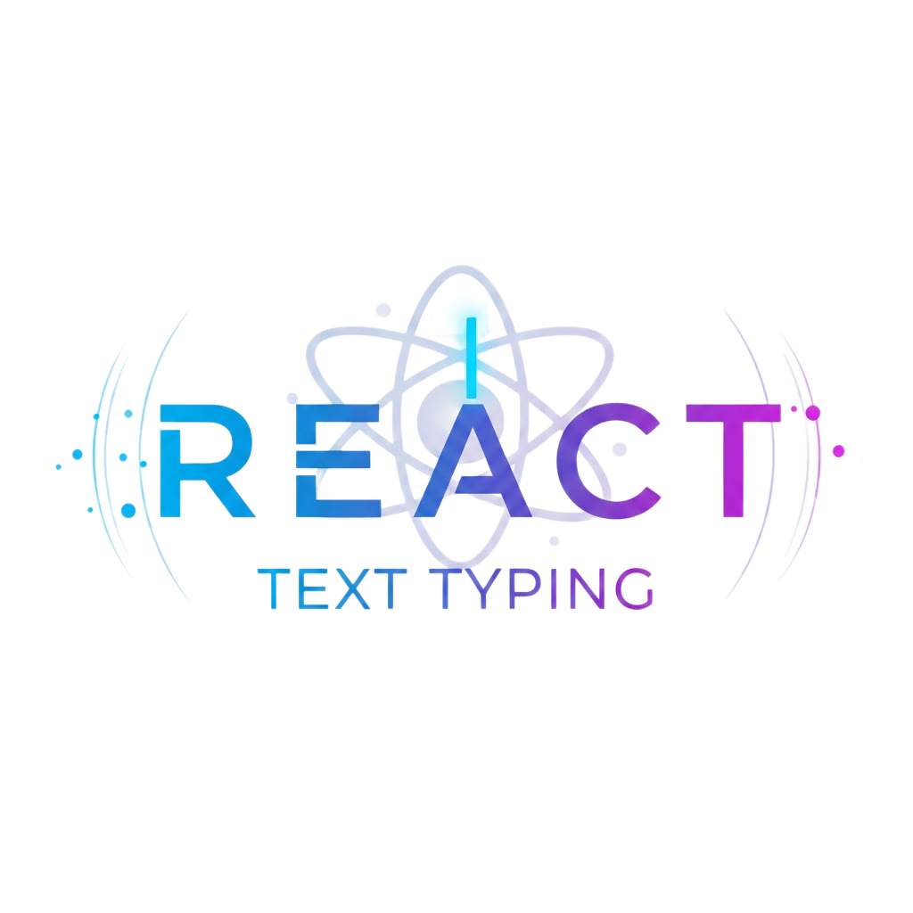

<p align="center">
  
</p>

<h1 align="center">react-text-typing</h1>

<p align="center">
  A lightweight React component that creates a realistic typewriter animation effect with cursor blinking.
</p>

<p align="center">
  <a href="https://www.npmjs.com/package/react-text-typing">
    
  </a>
  <a href="https://github.com/Oda2/react-text-typing/actions">
    
  </a>
  <a href="https://coveralls.io/github/Oda2/react-text-typing">
    
  </a>
  <a href="https://bundlephobia.com/package/react-text-typing">
    
  </a>
  <a href="https://opensource.org/licenses/MIT">
    
  </a>
</p>

---

## ✨ Features

- 🎯 **Lightweight** - Zero dependencies, tiny bundle (~11kb gzipped)
- ⚡ **Performant** - Built with React hooks, optimized for speed
- 🎨 **Customizable** - Colors, speed, font size, cursor blink
- ♿ **Accessible** - Semantic HTML, works with screen readers
- 📦 **Tree-shakeable** - Import only what you need
- 🔧 **TypeScript** - Full TypeScript support included
- 🧪 **Well tested** - 100% test coverage

## 📦 Installation

```bash
npm install react-text-typing
```

or

```bash
yarn add react-text-typing
```

## 🚀 Quick Start

```tsx
import TextTyping from 'react-text-typing';
import 'react-text-typing/css';

function App() {
  return <TextTyping text="Hello, World!" />;
}
```

## 💻 Usage

### Basic

```tsx
<TextTyping text="Welcome to my website" />
```

### Custom Speed

```tsx
<TextTyping text="Fast typing" speed={50} />
```

### Custom Colors

```tsx
<TextTyping text="Custom colors" colorText="#ff6b6b" colorTyping="#4ecdc4" />
```

### Disable Cursor Blink

```tsx
<TextTyping text="No blink" showBlink={false} />
```

### Custom Font Size

```tsx
<TextTyping text="Big text" fontSize="3em" />
```

### With Callback

```tsx
<TextTyping text="Callback example" onComplete={() => console.log('Done!')} />
```

### Custom Component

```tsx
<TextTyping text="Heading" component="h1" className="my-heading" />
```

## 📚 API Reference

| Prop          | Type                  | Default   | Description                            |
| ------------- | --------------------- | --------- | -------------------------------------- |
| `text`        | `string`              | Required  | Text to type out                       |
| `speed`       | `number`              | `500`     | Milliseconds between each character    |
| `colorText`   | `string`              | `#fff`    | Color of the typed text                |
| `colorTyping` | `string`              | `#0075D7` | Color of the typing effect             |
| `showBlink`   | `boolean`             | `true`    | Show/hide cursor blink                 |
| `fontSize`    | `string`              | `5em`     | Font size of the text                  |
| `timeTyping`  | `number`              | `10`      | Duration of typing animation (seconds) |
| `component`   | `string \| Component` | `"span"`  | HTML element or custom component       |
| `onComplete`  | `() => void`          | -         | Callback when typing finishes          |
| `className`   | `string`              | -         | Additional CSS class                   |

## 🎨 Styling

The component includes default CSS. To customize, you can:

1. **Override CSS variables:**

```tsx
<TextTyping text="Custom" colorText="#ff0000" colorTyping="#00ff00" />
```

2. **Add your own styles:**

```css
.text-typing {
  font-family: 'Fira Code', monospace;
}
```

3. **Import only CSS and customize:**

```js
import 'react-text-typing/css';
```

## 🛠️ Development

```bash
# Install dependencies
npm install

# Run tests
npm test

# Run tests with coverage
npm run coverage

# Run Storybook
npm run dev

# Build library
npm run build:lib

# Lint
npm run lint
```

## 🤝 Contributing

Contributions are welcome! Please read our [contributing guidelines](CONTRIBUTING.md) first.

1. Fork the repository
2. Create your feature branch (`git checkout -b feature/amazing-feature`)
3. Commit your changes (`git commit -m 'feat: add amazing feature'`)
4. Push to the branch (`git push origin feature/amazing-feature`)
5. Open a Pull Request

## 📖 Storybook

We use Storybook for component development and documentation. Run `npm run dev` to explore the component in an interactive environment.

## 🐛 Issues

Found a bug? Please [open an issue](https://github.com/Oda2/react-text-typing/issues) with a detailed description.

## 📝 License

MIT License - see the [LICENSE](LICENSE) file for details.

---

<p align="center">
  Made with ❤️ by <a href="https://github.com/Oda2">Renato Oda</a>
</p>
